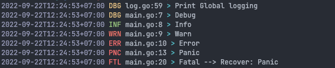
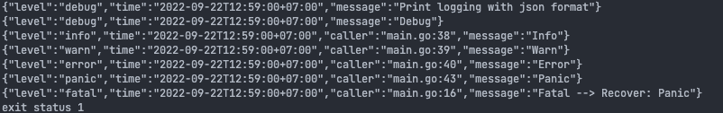

# `zlog` -- zerolog helper

## Dependencies package

- [github.com/rs/zerolog](github.com/rs/zerolog) - **Zero Allocation JSON Logger**

## Install

```shell
go get -u github.com/attapon-th/go-pkgs/zlog
```

## Getting Started

### Global Logging Example
```go
package main

import (
	"github.com/attapon-th/go-pkgs/zlog/log"
)

func main() {
	exampleGlobalLogging()
}

func panicHandler(l zlog.Logger) {
	x := recover()
	if x != nil {
		l.Fatal().Msgf("Fatal --> Recover: %v", x)
	}
}

func exampleGlobalLogging() {
	log.Print("Print Global logging")
	log.Debug().Msg("Debug")
	log.Info().Msg("Info")
	log.Warn().Msg("Warn")
	log.Error().Msg("Error")

	defer panicHandler(log.GetLogger())
	log.Panic().Msg("Panic")
}
```



### JSON Logging Example
```go
package main

import (
	"github.com/attapon-th/go-pkgs/zlog"
	"github.com/attapon-th/go-pkgs/zlog/log"
)

func main() {
	exampleNewLogging()
}

func panicHandler(l zlog.Logger) {
	x := recover()
	if x != nil {
		l.Fatal().Msgf("Fatal --> Recover: %v", x)
	}
}

func exampleNewLogging() {
	l := zlog.NewConsoleJSON()
	l.Print("Print logging with json format")
	l.Debug().Msg("Debug")

	// set caller
	l = l.EnableCaller()
	l.Info().Msg("Info")
	l.Warn().Msg("Warn")
	l.Error().Msg("Error")

	defer panicHandler(l)
	l.Panic().Msg("Panic")
}
```


